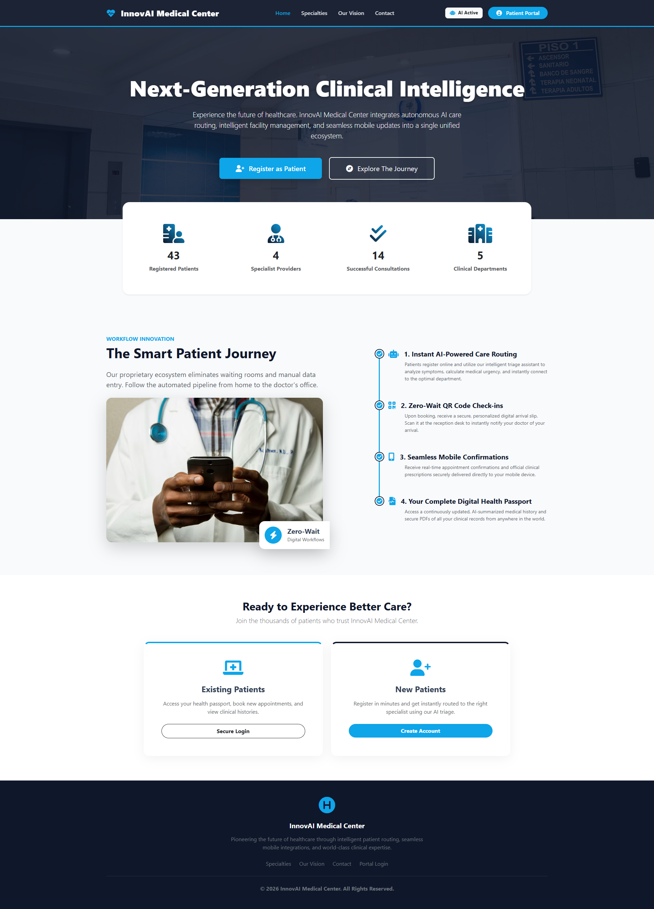
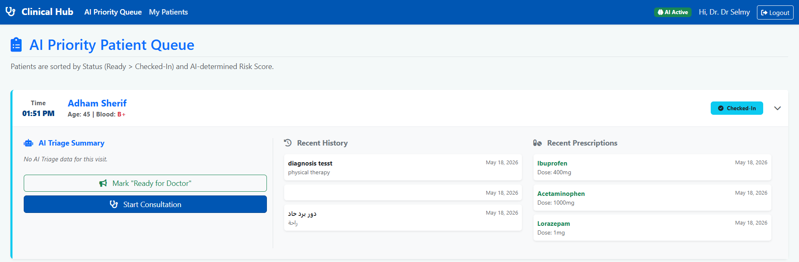
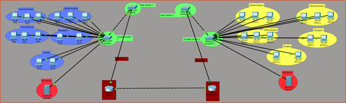
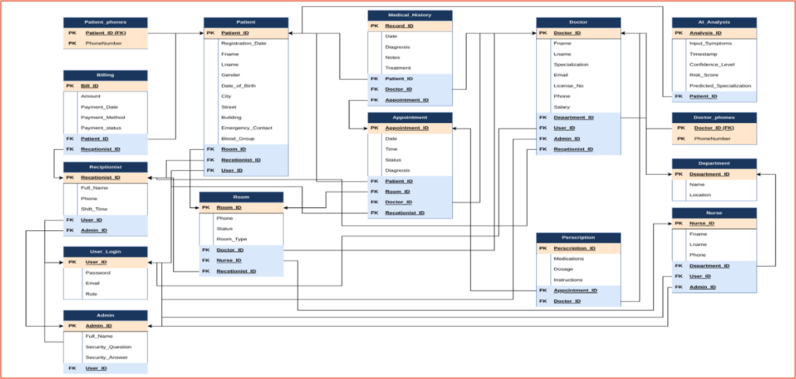

# 🏥 InnovAI Medical Center

A Next-Generation, AI-Integrated Hospital Management System (HMS)

InnovAI Medical Center is a fully functional, next-generation Hospital Management System (HMS) designed to eliminate operational friction across clinical and administrative environments. Since our initial prototype, the system architecture has undergone a complete overhaul. We have strategically deprecated heavy, client-side browser automation in favor of lightweight, decoupled Node.js microservices and have upgraded our core intelligence to utilize dynamic, deterministically constrained Large Language Models (LLMs).

The platform operates through five distinct, role-based user portals, delivering seamless patient communication, real-time clinical tracking, and autonomous AI-driven triage routing over a securely segmented network.

📸 **Figure 1 — Primary Web Gateway**  

---

## ⚡ Core System Innovations

**Universal Gateway Security**  
Authentication is centralized through a unified `login.php` gateway. Plaintext passwords are mathematically salted and hashed utilizing PHP's native `password_verify` function, enforcing robust bcrypt/Argon2 cryptographic algorithms.

**Asynchronous WhatsApp Document Delivery**  
A bespoke Node.js instance runs on `localhost:3000`, completely outside the XAMPP htdocs root. It utilizes the lightweight `@whiskeysockets/baileys` library paired with a pino logger to interface directly with WebSocket servers.

**Zero-Wait QR Check-Ins**  
Driven natively by `assets/js/qr_scanner.js` using the `Html5Qrcode` library. It features a mirror-toggle webcam feed that automatically decodes the payload, pauses the UI stream, and fires a background POST request to instantaneously update the patient's status to *Checked-In* without requiring a page refresh.

**Omnipresent AJAX Search**  
Data ingestion and retrieval are expedited via `assets/js/ajax_handlers.js`. Querying `search_patients_ajax.php` beyond two characters renders dynamic DOM lists instantly, seamlessly binding specific database IDs to medical forms.

---

## 🧠 AI Engine Routing & Clinical Integration

The clinical intelligence core of InnovAI has been upgraded to utilize the `llama3.3-70b-versatile` model via the API. To prevent unpredictable outputs, the LLM is operated with absolute determinism by locking the generation variance (temperature = 0.0).

📸 **Figure 8 — AI Triage Interface**  

### Inbound Regex Deep Search Algorithm & Payload Sanitization

Although the `llama3.3-70b-versatile` model is deterministic, LLM responses may still contain markdown wrappers or conversational padding that can fatally break strict `json_decode()` execution.

To fully immunize the backend, InnovAI **does not** attempt to parse the payload as a rigid JSON object. Instead, a Regex Deep Search Algorithm is applied, scanning the raw response buffer and extracting only the required semantic keys, regardless of surrounding syntax.

Algorithm characteristics:
- Operates on raw string payloads
- Ignores markdown, prose, and formatting artifacts
- Extracts values by key-pattern matching
- Guarantees database-safe scalar insertion

Regex-driven extraction logic (illustrative):

    INPUT: raw_llm_response_string

    FOR each required_key IN [priority_level, department, reasoning]:
        pattern = /"required_key"\s*:\s*"(.*?)"/si
        IF pattern matches:
            extract group(1) as value
        ELSE:
            assign NULL

    OUTPUT: sanitized associative array (schema-locked)

This approach completely decouples database integrity from LLM surface formatting behavior.

---

## 🏗️ Architecture & Network Topology

The deployment follows a decoupled microservice architecture operating over a simulated segmented enterprise network. Sensitive clinical data is fully isolated from external communication gateways.

Logical Multi-VLAN topology:

**VLAN 10 — Admin**  
Command-and-control subnet dedicated to administrative CRUD operations and financial dashboards.

**VLAN 20 — Clinical**  
Highly secure internal subnet restricted to the Doctor Portal (AI Priority Queue) and Nurse Portal (Live Floor Heatmap).

**VLAN 30 — DMZ / Services**  
Public-facing demilitarized zone hosting the XAMPP Web Server and the asynchronous Node.js WhatsApp Microservice gateway.

📸 **Figure 7 — Packet Tracer Simulation**  

---

## 🗄️ Database Architecture & Constitutional Rules

The InnovAI database enforces absolute structural integrity through strict relational constraints, automated derived attributes, and rigorous normalization.

- 15 foundational tables
- Zero redundant storage
- Referential integrity enforced at engine level

### Relational Normalization Analysis (3NF / BCNF)

The schema is mathematically engineered to satisfy Boyce-Codd Normal Form (BCNF). For every non-trivial functional dependency X → Y, X is guaranteed to be a superkey, eliminating insertion, update, and deletion anomalies.

### Automated Database Triggers

All physical derived attributes are handled natively by MySQL. Patient age is continuously synchronized via asynchronous triggers bound directly to the `Date_of_Birth` attribute, removing all application-layer computation overhead.

📸 **Figure 6 — Conceptual ERD**  

---

## 📂 Repository Structure

The complete system, including source code, schemas, and documentation, is fully open-source.

- `Proposal.pdf` — Project scope and technical objectives  
- `ERD.pdf` — Entity-Relationship diagrams  
- `Schema.pdf` — Conceptual schema visualization  
- `InnovAI_Medical_Center.pdf` — Official final report  
- `SQL_Code.sql` — Database schema and mock data  
- `Acknowledgement.md` — Credits and supervision  
- `/hospital_management_system` — XAMPP web server + Node.js gateway

---

## 👥 Engineering Team

Developed by Level 2 students — Faculty of Computers and Information Technology (FCIT) -  Innovation University, Egypt:

- **Youssef Sameh Ahmed Noby**  Team Leader
- **Ahmed Hesham Ramadan Ismail**  
- **Eyad Ayman Mohamed Talaat**  
- **Moatasem Mohamed Mostafa Saied**  
- **Marwan Bahaa Mohammed Elsayed**  
- **Youssef Wael Atef Mohamed**

For full tooling, libraries, and academic supervision details, see `Acknowledgement.md`.
